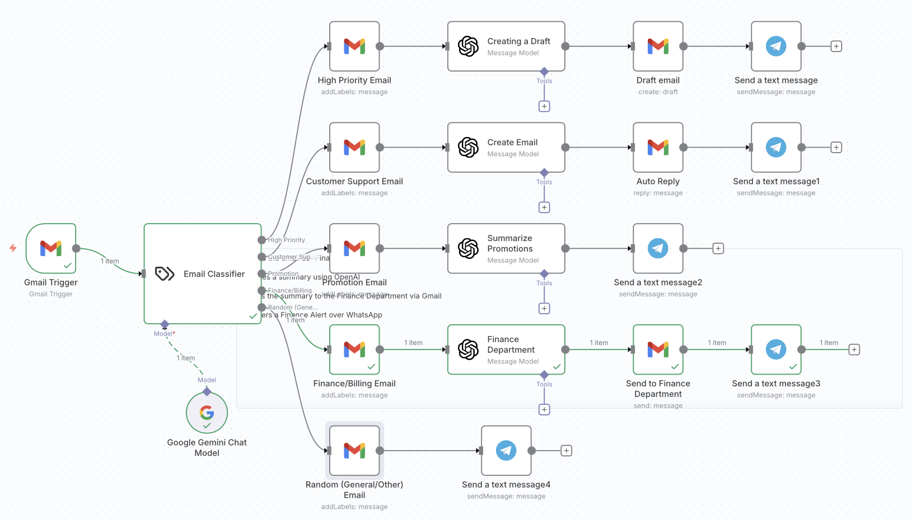
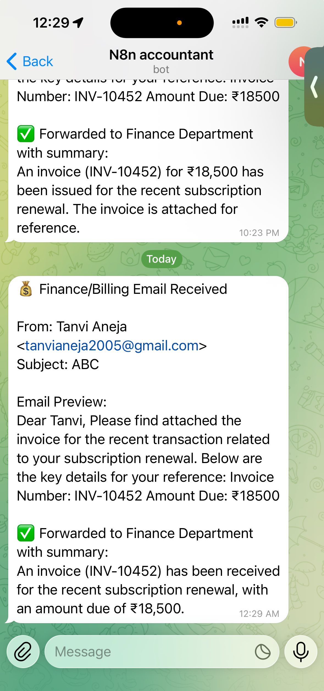
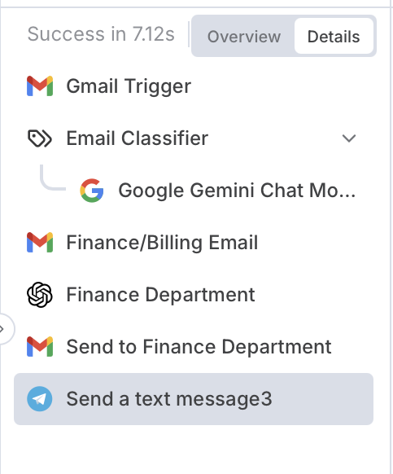

# 📬 SmartMail AI: Automated Email Classification & Response System

This project is an AI-powered email automation workflow built using **n8n**, integrating **Google Gemini**, **OpenAI**, and **Telegram** to intelligently manage Gmail inboxes.

It automates email classification, response generation, and real-time notifications — creating a complete AI communication assistant.

---

## 🚀 Overview

SmartMail AI automates the entire email handling process:

- Detects incoming Gmail messages in real time  
- Classifies emails into categories using AI  
- Generates context-aware responses using OpenAI  
- Sends instant notifications via Telegram  

It is designed for **self-hosted environments**, ensuring privacy, control, and scalability.

---

## ⚙️ System Architecture

Gmail Trigger → Gemini Classifier → Category Routing → OpenAI Response Generator → Telegram Notification

---

## 📸 Workflow Screenshots

### ⚙️ 1. SmartMail Workflow Design

---

### 🤖 2. Email Classification Output

---

### 📲 3. Telegram Notification Output

---

## 🔄 Workflow Breakdown

---

## A. 📧 Email Detection & Classification

### 🔁 Flow
Gmail Trigger → Gemini Email Classifier → Conditional Routing → Gmail Labeling

### 🧠 Description

- **Gmail Trigger Node** — activates workflow on new email arrival  
- **Google Gemini Classifier** — categorizes emails into:
  - High Priority  
  - Customer Support  
  - Promotion  
  - Finance/Billing  
  - Random/General  

- **Conditional Routing** — directs emails into category-specific branches  
- **Gmail Label Node** — applies automatic labels for structured inbox management  

### 🎯 Purpose
Enables intelligent inbox organization and prioritization without manual sorting.

---

## B. 🤖 Automated Response Generation

### 🔁 Flow
Category Branch → OpenAI Response Generator

### 🧠 Description

- **OpenAI Node** generates contextual replies based on email category:
  - High Priority → escalation/acknowledgment  
  - Customer Support → empathetic support reply  
  - Promotion → polite decline or interest response  
  - Finance → billing clarification/confirmation  
  - General → standard acknowledgment  

### 🎯 Purpose
Ensures professional, context-aware responses without manual effort.

---

## C. 📲 Real-Time Telegram Notifications

### 🔁 Flow
OpenAI Node → Telegram Node

### 🧠 Description

- Sends instant Telegram alerts with:
  - Sender details  
  - Email category  
  - AI-generated reply preview  

### 🎯 Purpose
Provides real-time visibility and quick response awareness outside Gmail.

---

## 🎯 Outcome

SmartMail AI creates a fully automated email assistant that:

- Classifies emails using AI  
- Generates intelligent responses  
- Sends real-time notifications  
- Reduces inbox overload  

---

## 🧠 Key Technologies

- n8n Automation  
- Google Gemini API  
- OpenAI API  
- Gmail API  
- Telegram Bot API  

---

## 👩‍💻 Author

Tanvi Aneja  
B.Tech Robotics & AI Engineering